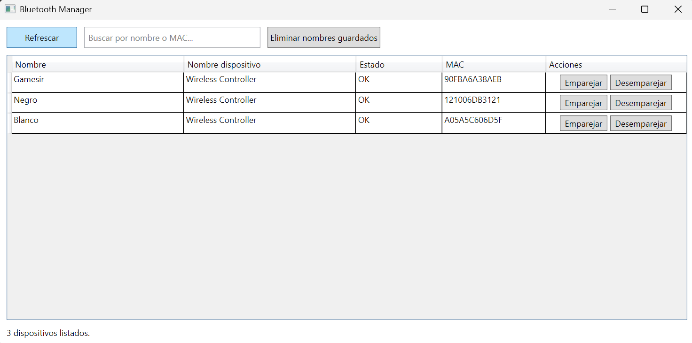

# Bluetooth Manager

**Bluetooth Manager** is a Windows desktop application that allows you to list, pair, and unpair Bluetooth devices, as well as save custom names for your devices.

---

## Features

- List all Bluetooth devices connected to the system.
- Save custom display names for devices.
- Pair and unpair devices using their MAC addresses.
- Search and filter devices.
- Log all operations in a `bt.log` file for debugging.
- **Troubleshoot connection issues**: Can help reconnect devices that were previously paired but fail to connect.

---

## Screenshot



---

## How to Resolve Connection Issues

If a device that was previously paired is not connecting properly:

1. Put the device into **pairing mode**.
2. Use BluetoothManager to **unpair** the device.
3. Use BluetoothManager to **pair** the device again.

This process often resolves connection problems with previously paired devices.

---

## Technologies

- Language: **C#**
- Platform: **.NET 6 / .NET 7**
- UI Framework: **WPF**
- Data serialization: **System.Text.Json**
- Scripts: **PowerShell** for listing and unpairing devices.
- Fallback: **WinRT APIs** (if available) for pairing/unpairing.

---

## Project Structure

- `Services/BluetoothService.cs` → Core logic for managing Bluetooth devices.
- `Models/Device.cs` → Data model for devices.
- `Helpers/StringResources.cs` → Application string resources.
- `MainWindow.xaml` → WPF user interface.
- `MainWindow.xaml.cs` → Code-behind for the UI.
- `App.config` / `App.xaml` → Global configuration and resources.
- `devices.json` → Stores custom device names (located in `%AppData%\BluetoothManager\`).
- `bt.log` → Log file for debugging.

---

## Usage

1. Run the application.
2. Click **Refresh** to list available Bluetooth devices.
3. Use the search box to filter devices by name or MAC address.
4. Edit the displayed name to save a custom device name.
5. Click **Pair** or **Unpair** to pair or unpair selected devices.
6. Click **Clear Saved** to remove all saved names.
7. For troubleshooting, follow the steps in "How to Resolve Connection Issues".

---

## External Dependencies

- `BluetoothDevicePairing.exe` → Optional external tool for pairing/unpairing devices by MAC. The app searches in multiple locations:
  - Application directory
  - Parent directory
  - Current working directory

- **PowerShell** → Required for listing devices and fallback unpair operations using `pnputil`.

---

## Data Files

- **devices.json**: Stores custom device names in JSON format.

```json
{
  "names": {
    "AA:BB:CC:DD:EE:FF": "Headphones",
    "11:22:33:44:55:66": "Keyboard"
  }
}
